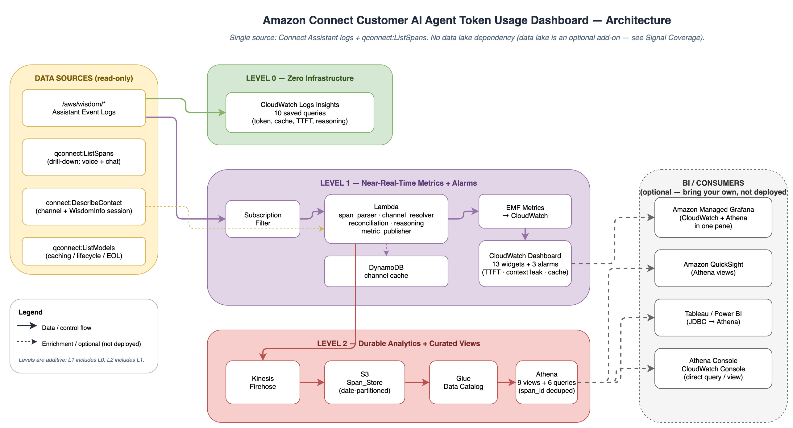

# Amazon Connect Customer AI Agent Token Usage Dashboard

> **Sample code for educational purposes only. Not for production use.**

[](https://opensource.org/licenses/MIT-0)
[](https://www.python.org/downloads/)
[](https://docs.aws.amazon.com/cdk/v2/guide/home.html)
[]()

Token, cache, reasoning, and time-to-first-token (TTFT) insights for Amazon
Connect AI agents (Amazon Q in Connect). This sample surfaces usage signals that
the built-in AI Agent Performance dashboard and the Connect analytics data lake
do not expose, and adds an insights layer that ranks them into evidence-backed
actions.

It reads from Amazon Connect Assistant event logs and `qconnect:ListSpans`. It
requires no Lake Formation resource share and no `BatchAssociateAnalyticsDataSet`
call.

---

## Production readiness

This is sample code that demonstrates a pattern. It is not production-ready as
delivered. Before any production use, please:

1. **Deploy to a non-production environment first** and validate the behaviour
   against your own Amazon Connect traffic.
2. **Evaluate it against your organization's security, compliance, and
   operational requirements**, and review it with your security team.
3. **Add the controls appropriate to your workload** before promoting to
   production. Depending on your requirements, these commonly include (but are
   not limited to):
   - Encryption with AWS KMS customer-managed keys (CMKs) for the S3 Span_Store
     and the DynamoDB table
   - Least-privilege IAM scoping tightened to your accounts and resources
   - Backup and retention (for example, S3 versioning and longer log retention)
   - Centralized logging, monitoring, and alerting to your standards
   - Network and account isolation per your landing-zone controls
4. **Complete your own security review** and align the deployment with the
   [AWS Well-Architected Framework](https://aws.amazon.com/architecture/well-architected/).

The [Security](#security) section explains how to report issues. This sample
applies a baseline of safe hardening (S3 public-access block, TLS enforcement,
S3-managed encryption, access logging, and DynamoDB point-in-time recovery), but
the controls above remain your responsibility for a production deployment.

---

## What this adds

These signals are not available in the built-in AI Agent Performance dashboard or
the Connect analytics data lake. Each row cites the log field it derives from.

| Signal | Why it matters | Source |
|---|---|---|
| Prompt cache economics | No cache columns in the `ai_prompt` data lake table. 81% of tokens were uncached in the validation dataset. | Log span fields |
| Time to first token (TTFT) | The data lake carries total latency only. TTFT is the silence the caller hears before the agent responds. | `time_to_first_token_ms` |
| Reasoning token share | `output_token` is a single total. Roughly 44% of output was reasoning the customer never sees. | `output_messages` parsing |
| Barge-in token waste | The data lake carries a boolean `invocation_success`. This attributes the tokens discarded when a caller interrupts. | `status=ERROR, error_type=barge_in` |
| Output ceiling proximity | `request_max_tokens` is absent from the data lake. Detects truncation risk. | Span field comparison |
| Near-real-time alarms | The data lake is daily batch. These alarms fire within minutes. | EMF metrics |
| Context growth curve | Requires turn ordering within a contact. Not available as a metric. | Span ordering |
| Instruction size overhead | `system_instructions` appears only in the span, not the data lake. | Character count + calibrated coefficient |

See [`docs/signal-coverage.png`](docs/signal-coverage.png) for how these signals
relate to the built-in metrics and the data lake.

## What this does not rebuild

Amazon Connect already provides the **31 built-in AI agent metrics** through
`connect:GetMetricDataV2` and the AI Agent Performance dashboard. This sample
intentionally leaves them in place:

**AI Agent:** `ACTIVE_AI_AGENTS`, `AI_AGENT_INVOCATIONS`,
`AI_AGENT_INVOCATION_SUCCESS`, `AI_AGENT_INVOCATION_SUCCESS_RATE`,
`AI_AGENT_RESPONSE_HELPFUL`, `AI_AGENT_RESPONSE_NOT_HELPFUL`,
`AVG_AI_AGENT_CONVERSATION_TURNS`

**AI Session:** `AI_HANDOFFS`, `AI_HANDOFF_RATE`, `AI_RESPONSE_COMPLETION_RATE`,
`AI_INVOLVED_CONTACTS`, `AVG_AI_CONVERSATION_TURNS`, `COMPLETENESS_SCORE`,
`FAITHFULNESS_SCORE`, `GOAL_SUCCESS_RATE`, `PROACTIVE_INTENTS_ANSWERED`,
`PROACTIVE_INTENTS_DETECTED`, `PROACTIVE_INTENTS_ENGAGED`,
`PROACTIVE_INTENT_ENGAGEMENT_RATE`, `PROACTIVE_INTENT_RESPONSE_RATE`

**AI Prompt:** `AI_PROMPT_INVOCATIONS`, `AI_PROMPT_INVOCATION_SUCCESS`,
`AI_PROMPT_INVOCATION_SUCCESS_RATE`, `AVG_AI_PROMPT_INVOCATION_LATENCY`

**AI Tool:** `AI_TOOL_INVOCATIONS`, `AI_TOOL_INVOCATION_SUCCESS`,
`AI_TOOL_INVOCATION_SUCCESS_RATE`, `AI_TOOL_PARAMETER_ACCURACY`,
`AI_TOOL_SELECTION_ACCURACY`, `AI_TOOL_UTILIZATION_ACCURACY`,
`AVG_AI_TOOL_INVOCATION_LATENCY`

**AI Knowledge Base:** `KNOWLEDGE_CONTENT_REFERENCES`

Please use those directly from the AI Agent Performance dashboard or
`connect:GetMetricDataV2`.

For what is intentionally out of scope, and the candidate findings that were
tested and excluded, see [Reference](docs/REFERENCE.md).

---

## Architecture



Data sources (Connect Assistant logs, `qconnect:ListSpans`,
`connect:DescribeContact`, `qconnect:ListModels`) feed three additive deployment
levels. Level 0 runs saved Logs Insights queries with no infrastructure. Level 1
adds a subscription filter, a Lambda parser, EMF metrics, a dashboard, and
alarms. Level 2 adds a Firehose to an S3 Span_Store, a Glue catalog, and Athena
curated views. Grafana, QuickSight, Tableau/Power BI, and the AWS consoles
consume the outputs.

The diagram source is [`docs/architecture.drawio`](docs/architecture.drawio)
(open with the Draw.io editor). Two companion views:

- [`docs/data-flow.png`](docs/data-flow.png) — the Lambda processing flow per invocation
- [`docs/signal-coverage.png`](docs/signal-coverage.png) — what this sample adds vs what Connect already provides

### Deployment levels (additive)

| Level | What you get |
|---|---|
| **LEVEL_0** | 10 saved Logs Insights queries. No compute, no storage. |
| **LEVEL_1** | + Lambda parser, EMF metrics, CloudWatch dashboard, 3 alarms |
| **LEVEL_2** | + S3 Span_Store, Firehose, Glue, Athena views, named queries |

Cost drivers per level are described in [Reference](docs/REFERENCE.md#cost-model).
For an estimate against your own volume, use the
[AWS Pricing Calculator](https://calculator.aws/).

---

## Prerequisites

1. **AWS credentials** for the target account with permissions listed below.

2. **Connect AI agent logging enabled** on each assistant. This requires the
   `wisdom:AllowVendedLogDeliveryForResource` permission, then the CloudWatch
   log-delivery APIs (run in order, per assistant):
   ```bash
   aws logs put-delivery-source \
     --name "wisdom-<assistant-name>" \
     --resource-arn "arn:aws:wisdom:<region>:<account>:assistant/<id>" \
     --log-type EVENT_LOGS

   aws logs put-delivery-destination \
     --name "wisdom-<assistant-name>-dest" \
     --output-format json \
     --delivery-destination-configuration \
       destinationResourceArn="arn:aws:logs:<region>:<account>:log-group:/aws/wisdom/<assistant-name>"

   aws logs create-delivery \
     --delivery-source-name "wisdom-<assistant-name>" \
     --delivery-destination-arn "<destination-arn>"
   ```
   See [Enable logging for AI agents](https://docs.aws.amazon.com/connect/latest/adminguide/monitor-ai-agents.html).

3. **AI agent traces enabled** (for drill-down): call recording on, plus *Enable
   Bot Analytics, Transcripts, and AI Agent Traces* and *Enable Automated
   Interaction Logs* in the instance settings. AI agent traces are voice-channel
   only; `qconnect:ListSpans` covers both voice and chat.

4. **Python 3.11+** and **AWS CDK v2**:
   ```bash
   npm install -g aws-cdk
   pip install -e ".[infra,dev]"
   ```

5. **CDK bootstrap** (one-time per account/region):
   ```bash
   cdk bootstrap aws://<ACCOUNT_ID>/<REGION>
   ```

---

## Deploy

```bash
cd infra
cdk deploy
```

Single command. Provisions all resources for the configured deployment level.

### Configuration

No identifiers are hardcoded. Configure via CDK context — either edit the
`context` block in `infra/cdk.json`:

```json
{
  "app": "python3 app.py",
  "context": {
    "assistant_log_groups": "/aws/wisdom/your-assistant-1,/aws/wisdom/your-assistant-2",
    "connect_instance_ids": "your-instance-id-1,your-instance-id-2"
  }
}
```

Or pass them on the command line:

```bash
cdk deploy \
  -c assistant_log_groups="/aws/wisdom/your-assistant-1,/aws/wisdom/your-assistant-2" \
  -c connect_instance_ids="your-instance-id-1,your-instance-id-2"
```

Account and region default to your AWS credentials (`CDK_DEFAULT_ACCOUNT` /
`CDK_DEFAULT_REGION`). Override with `-c account=...` and `-c region=...` if needed.

### Backfill historical data

The subscription filter captures new events only. To load history (within log
retention), set the environment variables from your stack outputs, then run:

```bash
# Get the values from the deployed stack
aws cloudformation describe-stacks --stack-name ConnectAITokenEfficiency \
  --query 'Stacks[0].Outputs' --output table

export AWS_REGION="your-region"
export ASSISTANT_LOG_GROUPS="/aws/wisdom/your-assistant-1,/aws/wisdom/your-assistant-2"
export CONNECT_INSTANCE_IDS="your-instance-id-1,your-instance-id-2"
export DELIVERY_STREAM_NAME="<DeliveryStream output>"
export CHANNEL_CACHE_TABLE="<ChannelCacheTable output>"

python scripts/backfill.py
```

**Re-running backfill is safe.** Firehose delivery is at-least-once and the
script does not check what already landed in S3, so re-running writes the same
spans again. Every Athena curated view deduplicates by `span_id` (see the
`v_span_enriched` base view — all other views read from it), so no query,
dashboard, or metric ever reflects a duplicate regardless of how many times
backfill runs. If you also want the raw S3 objects to stay unique, empty the
`spans/` prefix before re-running.

### Teardown

```bash
cd infra && cdk destroy
```

Removes all resources. S3 bucket is configured with `autoDeleteObjects`.

---

## What you get after deploy

### CloudWatch Dashboard: `ConnectAI-TokenEfficiency`

13 widgets across 4 sections:
- **Token Economics:** Tokens/contact, TTFT p50/p90 with 3s threshold, barge-in waste
- **Cache Economics:** Hit ratio, token composition (read/write/fresh), total vs cached
- **Reasoning Efficiency:** Share (incl/excl tool), absolute tokens, output ceiling hits
- **Operational Health:** Reconciliation mismatches, decode speed monitor, pipeline throughput

### 3 CloudWatch Alarms

| Alarm | Trigger | Threshold |
|---|---|---|
| `ConnectAI-ContextLeak-TokensPerContact` | Tokens/contact exceeds baseline | 50,000 (placeholder) |
| `ConnectAI-TTFT-P90-DeadAir` | TTFT p90 exceeds caller patience | 3,000 ms |
| `ConnectAI-CacheRegression` | Cache hit ratio drops | 30% |

Replace thresholds with your baseline after 14 days of data.

### 10 Logs Insights Saved Queries (Level 0)

Available in CloudWatch > Logs Insights > Saved queries:
- `L0 - Token Summary`
- `L0 - Tokens per Agent`
- `L0 - TTFT Percentiles`
- `L0 - Cache State per Agent`
- `L0 - Model Attribution`
- `L0 - Tokens per Contact`
- `L0 - Barge-In Token Waste`
- `L0 - Output Ceiling Proximity`
- `L0 - System Instruction Size per Agent`
- `L0 - Span Type Overview`

### 9 Athena Curated Views

Database: `connect_ai_token_efficiency`

| View | Purpose |
|---|---|
| `v_span_enriched` | Deduplicated base view (one row per `span_id`) — all other views read from it |
| `v_contact_rollup` | Per-contact totals (tokens, model time, tool time, reasoning, escalation) |
| `v_agent_daily` | Per-agent per-day summary |
| `v_cache_state` | ON/OFF/MIXED per agent with hit ratio |
| `v_reasoning_split` | Reasoning share per agent (both denominators) |
| `v_latency_percentiles` | TTFT and duration per agent per model |
| `v_context_growth` | Input tokens by turn ordinal |
| `v_model_capability` | Per-model aggregates |
| `v_data_quality` | Reconciliation and coverage health |

### 6 Athena Named Queries

- `connect-ai-context_growth_curve`
- `connect-ai-cache_warmup_profile`
- `connect-ai-agent_version_comparison`
- `connect-ai-reasoning_distribution`
- `connect-ai-token_outlier_contacts`
- `connect-ai-daily_token_summary`

---

## Reference documentation

For deeper detail, see [`docs/REFERENCE.md`](docs/REFERENCE.md):

- What is out of scope, and the findings tested and excluded
- Required IAM permissions (per role)
- Calibrated constants and their provenance
- Connecting BI tools (Amazon Managed Grafana, Amazon QuickSight, Tableau, Power BI)
- Cost model and cost drivers
- Log retention constraint
- Optional upgrade: Connect analytics data lake
- Validation dataset and sample-size caveats
- Evidence base and repository structure

---

## Security

See [CONTRIBUTING](CONTRIBUTING.md#security-issue-notifications) for more
information.

## License

This library is licensed under the MIT-0 License. See the [LICENSE](LICENSE)
file.
